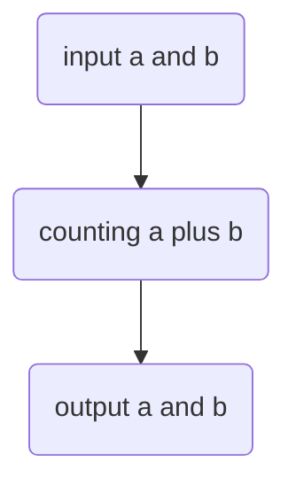

``` C
//this is my first homework in computing mythods.
#include <stdio.h>
#include <stdlib.h>
#include <math.h>

int main() {
    double x[10];
    x[0]=0.0;x[1]=0.5;x[2]=1.0;x[3]=sqrt(2.0);x[4]=10.0;x[5]=100.0;x[6]=300.0;
    int i;
    for(i=0;i<7;i++){
        double y=0.0,k=1.0,num;
        for(k=1.0;k<=100000000.0;k++)
        {
            num=1.0/(k*(k+x[i]));
            y+=num;
        }
        printf("x=%.15e y=%.15e\n",x[i],y);
    }
    return 0;
}
```
a flow chart which can describe an \( a+b \)problem.  


my favourite formula:  
\( E = mc^2 \)